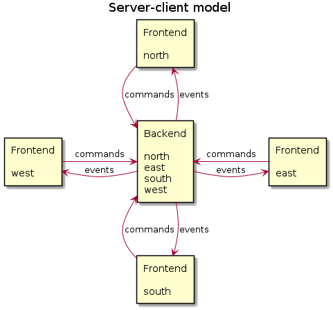
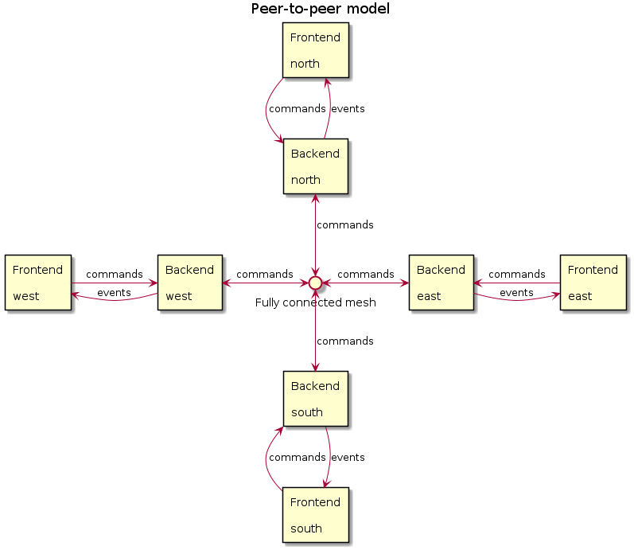

Play contract bridge online: https://bridge.jmoisio.eu/

---

# Bridge

[Contract bridge](https://en.wikipedia.org/wiki/Contract_bridge) is a
well‐known trick‐taking card game where two partnerships compete each
other.

The goal of this project is to produce a lightweight peer‐to‐peer
bridge application for social games.

## Features

- GUI for playing social bridge games
- Multiple models of networking: client‐server and peer‐to‐peer
- Cards can be exchanged between peers by mental card game protocol
  preventing cheating (although see section Security for disclaimers)
- Duplicate scoring (but no support for duplicate deals yet…)

## Installing

The project is built using [CMake](https://cmake.org/).

The bridge application is written in C++ (backend) and Python
(GUI). The backend does all actual game logic and communicates with
the frontend and other peers using TCP sockets.

The backend needs modern‐ish C++ compiler supporting C++17. The
project depends on
- [ZeroMQ](https://zeromq.org/) for messaging (v4.3)
- [CPPZMQ](https://github.com/zeromq/cppzmq) The C++ bindings for
  ZeroMQ (v4.6)
- [json](https://github.com/nlohmann/json) to serialize and
  deserialize messages (v3.9)
- [Lua](https://www.lua.org/) for configuration parsing (v5.3)
- [Boost](https://www.boost.org/) for various things (v1.71)
- [RocksDB](http://rocksdb.org/) for persistence (v5.17, optional)

The versions in the bracket indicate the recommended minimum version
that have been tested to work with the project.

The project has been tested and compiles with GCC version 10.2.

Optionally [LibTMCG](http://www.nongnu.org/libtmcg/) can be used for
secure card exchange.

[Googletest](https://github.com/google/googletest) is used to build
unit tests. As recommended by the maintainers of the project, instead
of relying on any version of googletest found on the local computer,
it is downloaded when required.

To build everything and run unit tests for the backend

    $ mkdir /the/build/directory
    $ cd /the/build/directory
    $ cmake /the/source/directory
    $ make
    $ make test
    $ make install

**Experimental:** You can also build the backend as Docker image:

    $ docker build -t jasujm/bridge .
    $ docker run -p 5555:5555 -p 5556:5556 jasujm/bridge

## Building documentation

[Doxygen](http://www.stack.nl/~dimitri/doxygen/) is used to generate
the documentation for the backend:

    $ cd /the/build/directory
    $ make docs

## Network topologies

The bridge application supports either client–server or peer–to–peer
topologies. In the basic client–server model a single backend
application acts as a server serving multiple frontend
applications. The single backend instance controls all positions of
the game and assigns them to the frontend applications as they join
the game.

In the basic peer–to–peer model there are four backend applications,
presumably running on each player’s personal computer. The players
must agree on their positions in advance before starting the game,
because the application does not currently support negotiating
positions between the peers.

More on how to configure and run the backend and the frontend below.

## Setting up the application

### Backend

Run the backend like this:

    $ bridge [-vv] [--config=config‐file]

The backend opens two sockets into two consequtive ports (by default
5555 and 5556 unless otherwise configured). The first one is used to
receive commands from the frontends and/or peers. The second one is
for publishing events to the frontends.

The options are:

    --config   A lua script used to configure the backend.
    -v         One to enable INFO level logging, two to enable DEBUG level.

The config file is used to determine the network topology. The
[sample config file](sample/config.lua) hosted in this repository contains
some possible options for different kinds of games with and without peers.

A single backend application can host multiple games identified by an
UUID. Peer–to–peer games need to be configured before startup.
Peerless (client–server) games can be created dynamically by the
client.

Note! The application does not yet correctly handle peers leaving and
rejoining the game. If a peer or a card server crashes, the session is
lost.

### Frontend

This repository only contains code for the backend. In order to play
bridge, you’ll also need a frontend. A GUI written in Python can be
found in my other repository at https://github.com/jasujm/bridgegui.

The GUI depends on
[PyQt5](https://www.riverbankcomputing.com/software/pyqt/download5) to
provide the GUI framework and [PyZQM](https://github.com/zeromq/pyzmq)
for messaging.

Run the frontend like this:

    $ bridgegui [--game UUID] [--create-game] endpoint

where `endpoint` is the control endpoint of the backend. Run
`bridgegui --help` to see the remaining options.

Unless the backend was configured to create a game at startup, the
first frontend to join needs to create a game using the
`--create-game` option.

#### Frontend display

The score sheet is displayed on the right. More rows are added to the
sheet after every deal.

Players and their cards are shown in the middle of the screen. The
player whose position has bold font has turn to call (during bidding)
or play a card to the trick (during playing).

#### Call

The bidding for the current deal is displayed on the left. Calls are
made by pushing the buttons and the call sequence is shown in the
table underneath. Enabled buttons correspond to the allowed calls.

#### Play

The cards for all the players are displayed in the middle area. During
the playing phase cards are played by clicking the card. Allowed cards
are opaque and cards that cannot be played to the current trick are
slightly transparent.

## Card server

If [LibTMCG](http://www.nongnu.org/libtmcg/) is found in the system,
CMake will generate target for the card server. Card server can be
used to execute secure mental card game protocol (ensuring that peers
cannot know the cards of the other peers except when all peers
cooperate within the normal laws of contract bridge). Small Python
program used to test the card server is run as part of the CTest
suite.

Uncomment the necessary sections in the sample config file and run
`bridgecs` along with the bridge application.

    peer@example.com$ bridge --config=sample/config.lua &
    peer@example.com$ bridgecs tcp://127.0.0.1:5560 tcp://*:5565 &
    peer@example.com$ bridgegui tcp://localhost:5555

The card server binds one endpoint for communicating with its
controlling bridge backend, and one endpoint for communicating with
its own peers. In the example above, the local TCP port 5560 is bound
for controlling the card server. Public TCP port 5565 is bound for
communicating with remote card server peers.

## Security

**Note! This feature is still experimental.**

The communication between nodes can be authenticated and encrypted
using CURVE mechanism implemented in the ZeroMQ library
(http://curvezmq.org/).

To start the backend with CURVE support, load a configuration file
containing CURVE keys. The [sample config file](sample/config.lua)
enables CURVE support when the `BRIDGE_USE_CURVE` environment variable
is set.

    $ export BRIDGE_USE_CURVE=1
    $ bridge --config=sample/config.lua

The GUI needs to configure the public key of the server. It can be
extracted from the server configuration script and saved to a file.

    $ bridgegui --server-key-file=server-key …rest of the args…

The card server acts both as server and client, and needs both keys

    $ export BRIDGE_USE_CURVE=1
    $ bridgecs --secret-key-file=secret-key --public-key-file=server-key       \
    >     …rest of the args…

The current implementation requires that a bridge backend and its card
server must share the same CURVE keypair.

The backend partially authenticates peers connecting to it by checking
that only peers with known public keys (those that are known to belong
to peers taking part in the game) are allowed to join a
game. Connections from the frontends are not authenticated.

Card server uses the keypair shared with its bridge backend to
authenticate both traffic between itself and the bridge backend, and
between itself and its card server peers.

All clients, peers and card servers authenticate outgoing connections
as part of the ZeroMQ CURVE mechanism.

Please see LibTMCG documentation for further information about its
security model and assumptions, in particular the honest‐but‐curious
security model.

## Persistence

**Note! This feature is experimental. The format of persisted data may change
any time.**

The backend supports the persistence of games, deals and players. This feature
is enabled if RocksDB is found in the system and the data directory is set in
the config file. In the [sample config file](sample/config.lua) it is enabled if
the `BRIDGE_USE_RECORDER` environment variable is set.

    $ export BRIDGE_USE_RECORDER=1
    $ bridge --config=sample/config.lua

Persistence is not supported for games with peers.

## TODO

This is hobby project I do to learn about making robust network
software. Because of that nature of the project, the interesting
networking stuff comes first and the (in comparison) boring UX stuff
comes later. In approximate order of importance the next goals for
this project are:

- Sane way to deploy and configure the application / orchestrate games
- Nicer user interface and other usability oriented features (claiming
  tricks, canceling moves etc.)
- Peer discovery

The first two items are for supporting using the backend to power a
[Bridge webapp](https://github.com/jasujm/bridgeapp).

## Copyright

Copyright © 2015–2020 Jaakko Moisio <jaakko@moisio.fi>

This program is free software: you can redistribute it and/or modify
it under the terms of the GNU General Public License as published by
the Free Software Foundation, either version 3 of the License, or (at
your option) any later version.

This program is distributed in the hope that it will be useful, but
WITHOUT ANY WARRANTY; without even the implied warranty of
MERCHANTABILITY or FITNESS FOR A PARTICULAR PURPOSE.  See the GNU
General Public License for more details.

You should have received a copy of the GNU General Public License
along with this program.  If not, see <http://www.gnu.org/licenses/>.
